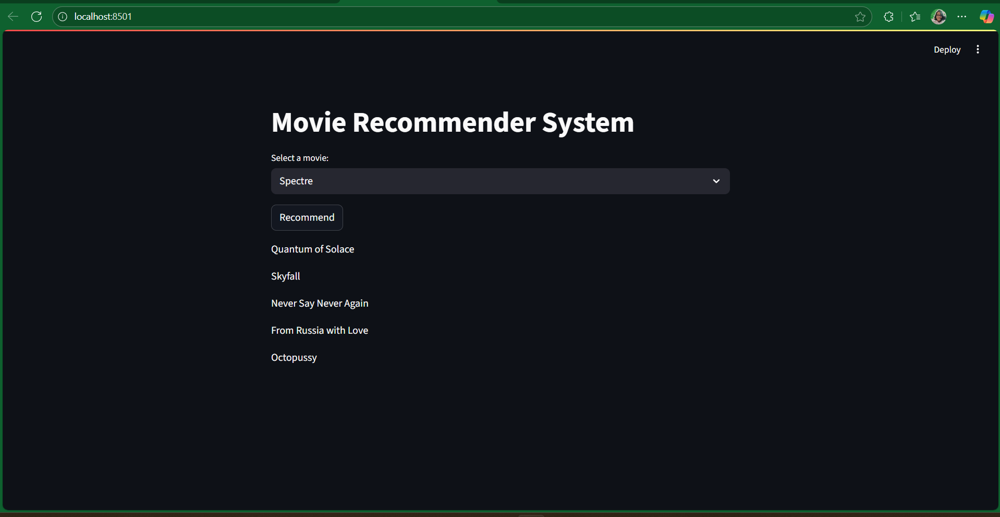

# Movie Recommender System 🎬




A simple **Streamlit + ML** app that recommends 5 similar movies when you pick one.


### How it works (very simple)

\- [`movies.pkl`]("https://drive.google.com/file/d/19YdYEVenHkMdRIH_P3Rwe2OxOlsAQbqq/view?usp=sharing") has movie info (title, id, tags)

\- `similarity.pkl` has similarity scores (cosine similarity of tags)

\- When you select a movie, we show the top 5 similar ones

\- (Optional) Posters via TMDB API


## Run locally

```bash

streamlit run app.py


